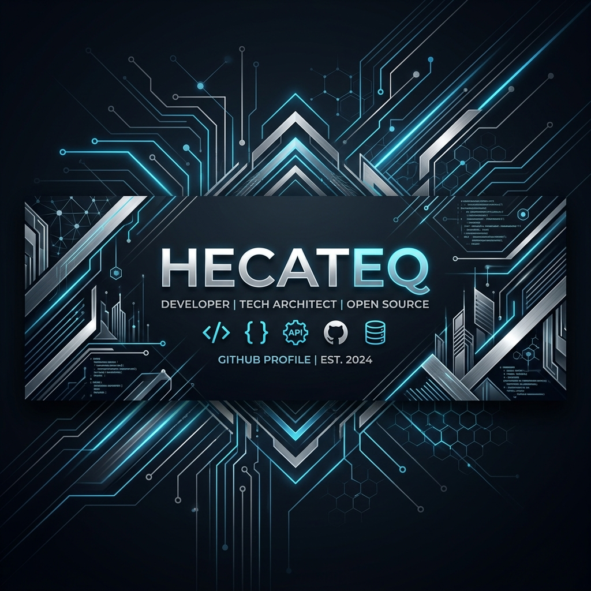

 

&nbsp;&nbsp;

&nbsp;&nbsp;

 

I build **deterministic AI agent orchestration systems**, custom developer tooling, and production-grade full-stack infrastructure. Most of my work lives in private repositories — the engineering direction is outlined below.

 

---

### ⚡ What I Build

<table>
<tr>
<td width="50%" valign="top">

**🤖 Agent Infrastructure**

- Custom agent routing & delegation engines
- Scan-first workspace analysis pipelines
- Memory-bank & context synchronization
- CLI-first developer productivity tools
- Structured post-execution reporting

</td>
<td width="50%" valign="top">

**📦 Product Systems**

- Cross-platform mobile applications
- Real-time 3D web configurators
- Backend APIs & admin dashboards
- Business workflow automation
- Interactive pricing & validation engines

</td>
</tr>
</table>

---

### 🔬 Public Research Direction

Independent custom fork based on [`oh-my-openagent`](https://github.com/code-yeongyu/oh-my-openagent) — my primary implementation ground for safer, deterministic agent orchestration.

 

| | Principle | Description |
|:---:|:---|:---|
| `01` | **Scan-First Execution** | Full workspace AST & dependency analysis before any code mutation |
| `02` | **Deterministic Routing** | Task delegation driven by explicit dependency trees, not loose prompts |
| `03` | **No Fake Fallbacks** | Explicit halt & report on failure — no silent errors, no mock success |
| `04` | **Dependency-Aware Scheduling** | Sub-agents scheduled in correct dependency order |
| `05` | **Structured Reporting** | Machine-readable post-execution logs fed back to project memory |

---

### 🛡️ Private Engineering

> Most of my production work is private. Below is a breakdown of active engineering domains.

&nbsp;<strong>📱 Private Product Systems</strong> &nbsp;— mobile, backend, economy

 

- Multilingual mobile applications with offline-first synchronization
- State-machine-driven economy systems, leaderboards & admin panels  
- Scalable backend architectures with real-time telemetry integration
- Cross-platform deployment pipelines with automated test coverage

&nbsp;<strong>🔧 Client & Business Automation</strong> &nbsp;— dashboards, workflows, AI ops

 

- Internal operational dashboards & process optimization tools
- AI-assisted workflow orchestrators for complex business logic
- Automated scheduling, report generation & delivery pipelines

&nbsp;<strong>🌐 3D & Interactive Web Systems</strong> &nbsp;— configurators, pricing, real-time UI

 

- Procedural 3D product configurators built with React & Three.js
- Real-time dimension input, live pricing engine & cart snapshot logic
- Server-side state validation and strict schema enforcement

---

### 🧠 Engineering Principles

| Principle | Rule |
|:---|:---|
| 🔍 **Scan before changing** | Understand the full codebase before touching a single file |
| 🚫 **No fake fallbacks** | Fail explicitly — mock success is worse than honest failure |
| ✅ **Verify before completion** | Lint, typecheck, test — then claim done |
| 🧩 **Context drives decisions** | Active workspace memory shapes every autonomous step |
| 🔗 **Dependency-aware execution** | Never run a task before its dependencies are settled |
| 📋 **Explicit reporting** | Every run produces a structured log: what changed, what failed, why |

---

### 🛠️ Stack

**Languages & Runtimes**

**Frameworks & UI**

**Data & Infrastructure**

---

### 🐍 Contribution Activity

<picture>
  <source media="(prefers-color-scheme: dark)" srcset="https://raw.githubusercontent.com/hecateq/hecateq/output/github-contribution-grid-snake-dark.svg" />
  <source media="(prefers-color-scheme: light)" srcset="https://raw.githubusercontent.com/hecateq/hecateq/output/github-contribution-grid-snake.svg" />
  
</picture>

---

**[@hecateq](https://github.com/hecateq)** &nbsp;·&nbsp; AI Agent Orchestration &nbsp;·&nbsp; Developer Tooling &nbsp;·&nbsp; Full-Stack Systems

