# hecateq

<p align="center">
  
</p>

<p align="center">
  <strong>Designing deterministic agent routing systems, workflow safety nets, and project-aware developer automation.</strong>
</p>

<p align="center">
  <a href="#-philosophy">Philosophy</a> •
  <a href="#-selected-rnd">R&D Projects</a> •
  <a href="#-agent-execution-flow">Execution Flow</a> •
  <a href="#-tech-stack">Tech Stack</a>
</p>

---

### 🧠 Philosophy

> *"Code generation without deep context is just noise. We build agents that read, understand, and verify before they dare write a single line."*

*   **Scan-First Architecture:** Never touch a file without analyzing the complete AST, dependencies, and project boundaries.
*   **Zero-Fake Fallbacks:** If a resolver cannot safely proceed, it halts and reports. No hallucinated loops, no silent failures.
*   **Verification Loop:** Automated runtime checks, type assertions, and lints run alongside the development cycle, not after.

---

### 🛡️ Selected R&D

#### ⚙️ [Hecateq OpenAgent](https://github.com/hecateq)
*An independent, production-ready fork of the OpenCode agent engine.*
*   **Focus:** Implementing deterministic routing rules, multi-agent dependency structures, and memory-bank validation.
*   **Safety Boundaries:** Isolates agent workspace environments and strictly constraints execution tokens to prevent runaway loops.

#### 🔧 CLI Developer Tooling & Workspace Automation
*Custom command-line utilities designed for agentic workflows.*
*   **Context Scanners:** Highly optimized workspace analysis tools feeding structured AST metrics to agent prompts.
*   **Memory-Bank Managers:** Automated synchronization tools for project state documents, active contexts, and architectural decision records.

---

### 📐 Agent Execution Flow

Below is the state-machine workflow implemented inside **Hecateq OpenAgent** to guarantee deterministic execution:

```mermaid
graph TD
    Start([Task Initiated]) --> Scan[Workspace AST & Dependency Scan]
    Scan --> Context{Context Sufficient?}
    
    Context -- No --> Refine[Automated Context Retrieval]
    Refine --> Scan
    
    Context -- Yes --> Plan[Generate Local Implementation Plan]
    Plan --> VerifyPlan{Plan Verified?}
    
    VerifyPlan -- No --> Halt([Explicit Halting & Error Reporting])
    
    VerifyPlan -- Yes --> Exec[Isolate & Execute Changes]
    Exec --> Test[Typecheck / Lint / Run Test Runner]
    
    Test -- Pass --> Commit[Commit & Generate Walkthrough]
    Test -- Fail --> Debug[Read Logs & Re-Route Exec]
    Debug --> Exec
    
    Commit --> Done([Done])

    style Start fill:#1f2328,stroke:#30363d,stroke-width:2px
    style Halt fill:#f85149,stroke:#30363d,stroke-width:2px,color:#fff
    style Done fill:#238636,stroke:#30363d,stroke-width:2px,color:#fff
    style Context fill:#1f2328,stroke:#30363d,stroke-width:2px
    style VerifyPlan fill:#1f2328,stroke:#30363d,stroke-width:2px
```



---

### 💻 Workspace CLI Output Example

A look at the workspace validation workflow using custom developer tooling:

```bash
$ hecateq-agent scan --target ./src
[+] Scanning workspace structure... (found 42 source files)
[+] Analyzing dependencies and TypeScript AST tree.
[+] Validating memory-bank status: ACTIVE
    | Active Context: Implementing deterministic resolver router.
    | Pending Tasks:  None. System fully aligned.
[+] Lint check: Clean
[+] Type check: Clean
[✓] Workspace status is READY for agent orchestration.
```

---

### 🛠️ Tech Stack

<table>
  <tr>
    <td valign="top" width="50%">
      <strong>🤖 Agent & Automation Tooling</strong>
      <ul>
        <li>TypeScript / Node.js (Core R&D)</li>
        <li>Python (AST Scanners & Scripting)</li>
        <li>Bash (CLI Wrappers & System Automation)</li>
        <li>Prisma & PostgreSQL (State Databases)</li>
      </ul>
    </td>
    <td valign="top" width="50%">
      <strong>🌐 Web & Mobile Development</strong>
      <ul>
        <li>React & Next.js (Admin & Configurator Views)</li>
        <li>Flutter & Dart (Cross-Platform Mobile Tools)</li>
        <li>Three.js / React Three Fiber (3D Visualizations)</li>
        <li>Docker & GitHub Actions (CI/CD Pipelines)</li>
      </ul>
    </td>
  </tr>
</table>

---

### 💬 Contact & Links

*   **GitHub:** [@hecateq](https://github.com/hecateq)
*   **Focus Areas:** AI Agent Orchestration, DevTool CLI Automation, Semantic Context Engines.
